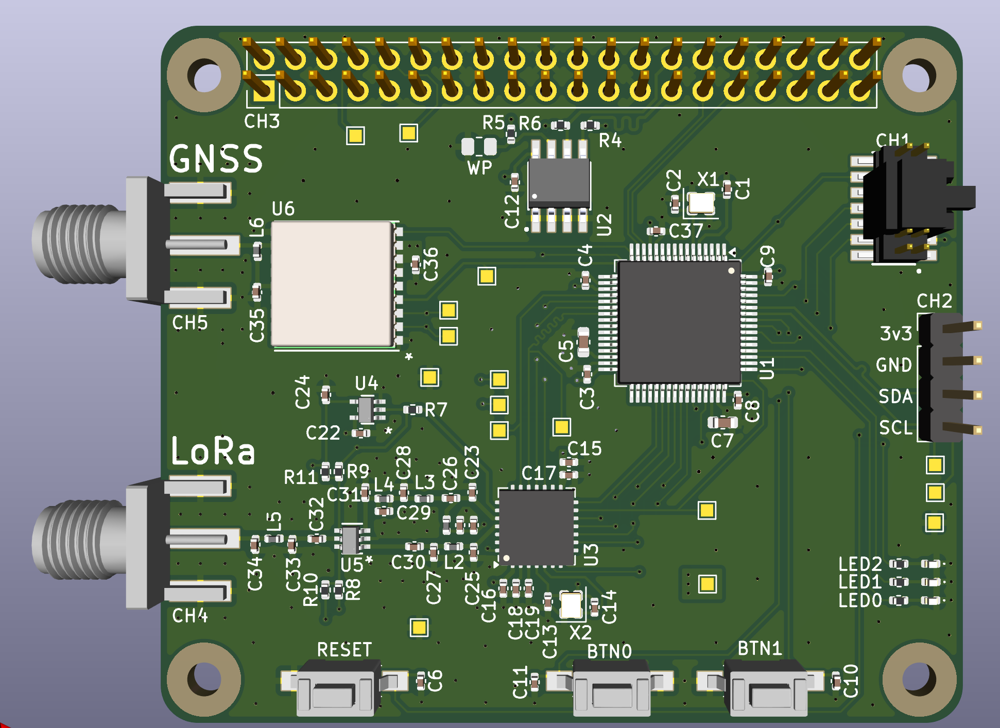

# LoRa Tracker HAT+

## GNSS

## LoRa

## Issues
The design intended to use the CADDetected flag on the SX1272 to timestamp
a valid preamble. However, the CAD mode was not intended for this use. Therefore, 
the ValidHeader flag was instead used.

## Future Plans
Battery power with solar charging.
