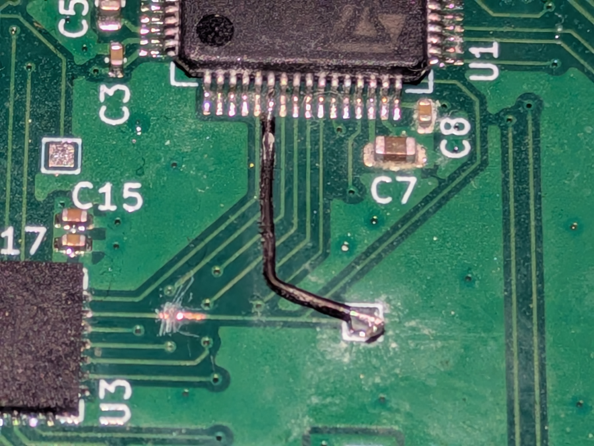

# LoRa Tracker HAT+

## Issues
The design intended to use the CADDetected flag on the SX1272 to timestamp
a valid preamble. However, the CAD mode was not intended for this use. Therefore, 
the ValidHeader flag was instead used. The DIO4 trace was cut and DIO3 was 
soldered to the CH1 input capture pin instead.

## Future Plans
- Battery power
- Solar Charging
