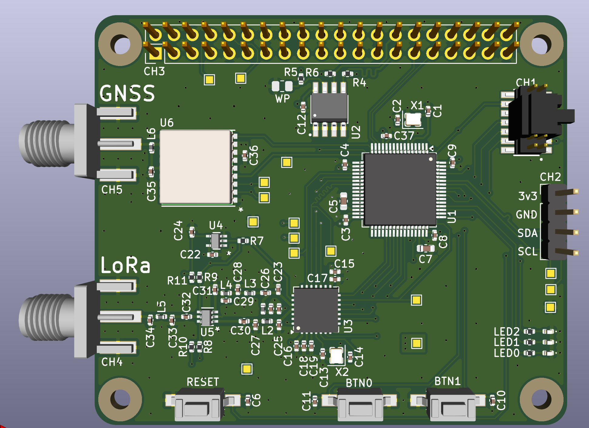
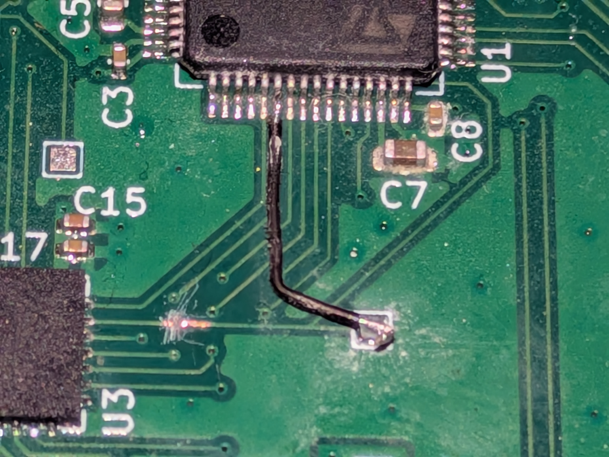

# LoRa Tracker HAT+

This board was developed for my engineering honours project, exploring how LoRa—a low-power, long-range wireless technology—could improve animal tracking. The idea: can LoRa signals alone be used to locate animals, removing the need for GNSS on collars? This could simplify devices, save battery, and reduce interference with wildlife behaviour, especially for small or sensitive species like wild bilbies.

The project investigates two localisation methods: **RSSI** and **Time-Difference of Arrival (TDoA)**.

The HAT+ is a custom Raspberry Pi board featuring an STM32H7, GNSS module, LoRa modem, and I2C environmental sensor. Three boards act as anchors to trilaterate LoRa packet sources. To handle packets moving at the speed of light, the anchors are synchronised via GPS pulse-per-second signals, keeping jitter under 20 ns.

## Challenges

- CADDetected on the SX1272 couldn’t reliably timestamp preambles; switched to using the **ValidHeader** flag instead.  
- DIO4 trace was cut, and DIO3 was rerouted to the STM32H7 input capture pin.  
- Standard crystals drift roughly 20 µs, translating to tens of km of error. Achieving nanosecond-level timing requires expensive oven-controlled crystals (~$450 for three), compared to ~$0.60 for standard ones. Lesson learned, but a great learning experience.

## Future Plans

- Battery power  
- Solar charging

